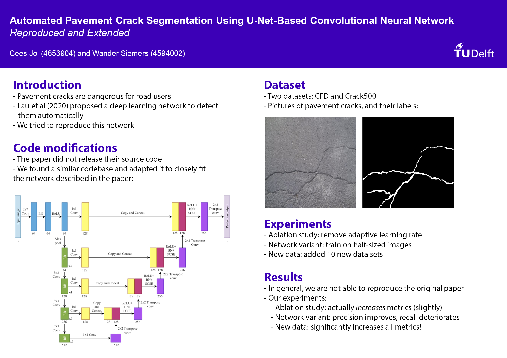

# Crack Segmentation

For the Deep Learning MSc course taught by [Jan van Gemert](https://www.tudelft.nl/ewi/over-de-faculteit/afdelingen/intelligent-systems/pattern-recognition-bioinformatics/computer-vision-lab/people/jan-van-gemert), we tried to reproduce [Automated Pavement Crack Segmentation Using U-Net-based Convolutional Neural Network](https://arxiv.org/abs/2001.01912) by Lau et al. The code builds on an [open-sourced repository](https://github.com/khanhha/crack_segmentation) by GitHub user [https://github.com/khanhha](khanhha), but is has been modified extensively. We've changed the encoder and decoder of the UNet architecture, changed the optimizer, implemented evaluation of the model, and ported the code to a Jupyter notebook. We then performed an ablation study and implemented a new network variant, namely, we trained the model quarter-sizes images to study transfer learning from small to large images. We also added additional data sets compared to Lau et al., indicating that 

In general, we were not able to reproduce the results presented in Lau et al. On the data sets used by Lau. et al, we got very low precision and recall, indicating that our model does not perform well on them. Because the authors did not publish their code, we could not verify that our network exactly matches theirs.
